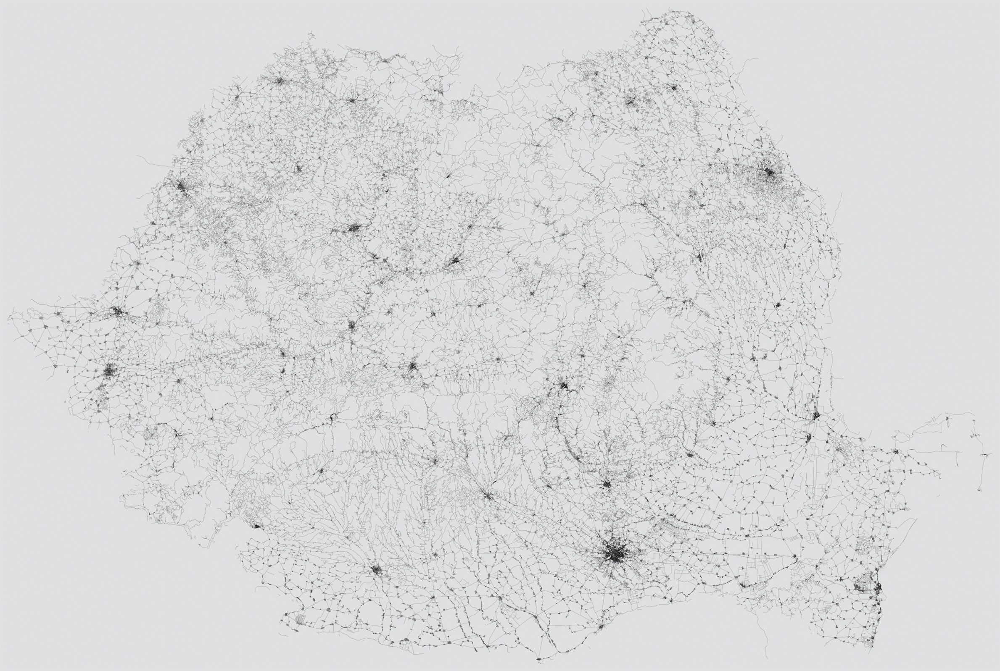

# every-street

Every street in Romania, based on OSM data.



## Installing

Clone this repository and run `npm install` on it.

## Using

Here's how to create a similar map for any area:

1. Dowload an `.osm.pbf` OpenStreetMap data file for your country/area from [download.geofabrik.de](http://download.geofabrik.de/europe.html) and place it into `data/data.osm.pbf`.
2. Extract data from your OSM file:
2.1. `node tools/extract-roads.js` will generate `output/roads.txt`;
2.2. `node tools/extract-nodes.js` will extract all nodes from the file into `output/nodes.txt`;
3. Create a database for the nodes so they can be looked up: `node tools/load-nodes.js`;
4. Replace the node references in your roads file with the actual coordinates of the nodes: `node tools/apply-nodes.js` will generate `output/roads-with-coords.txt`;
5. Transform the map coordinates to screen coordinates using a Spherical Mercator projection: `node tools/map-coords.js` will generate `output/roads-with-coords-screen.txt`;
6. Generate the final SVG: `node tools/generate-svg.js`.

Boom!

Or, if you're brave enough, run them all in one fell swoop:

```bash
node tools/extract-roads.js && node tools/extract-nodes.js && node tools/load-nodes.js && node tools/apply-nodes.js && node tools/map-coords.js && node tools/generate-svg.js
```

...and wait... and wait.

### Converting the SVG to PNG

ImageMagick has worked for me:

```bash
convert -density 900 output/roads.svg output/roads.png
```